# Helix

Helix is a self-hosted music player, discovery tool, and shared listening system built around a Subsonic-compatible music library.

It is meant for people who run their own music server but still want a more modern experience: search, queues, generated stations, playlists, shared listening, and optional fulfillment for tracks that are not already in the library.

Helix is still early software. It is usable, but expect rough edges, breaking changes, and setup work.

## Features

- Search and play music from a Subsonic-compatible library
- Play tracks, albums, playlists, and generated stations
- Create stations from artists, artist collections, and tags
- Run shared listening lobbies with guest queue and playback controls
- Join lobbies with simple 5-letter codes and optional password protection
- Mirror a Helix lobby into Discord voice with the optional [HelixBot](https://github.com/UnifiedKings/helixbot) companion project
- Add missing music to your library through optional fulfillment providers
- Repair metadata before finalized imports
- Use custom station providers through a plugin system
- Continue working with or without a configured Subsonic server, with unsupported features hidden or disabled

## Demo

### Search

Search across your configured music sources and jump directly into playback, albums, artists, or queue actions.

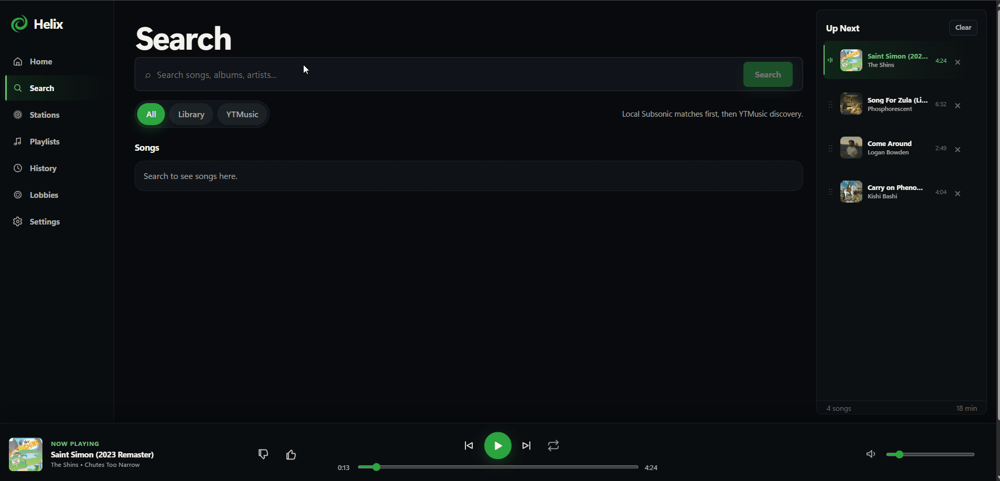

### Stations

Create a generated station from the music you want to build around.

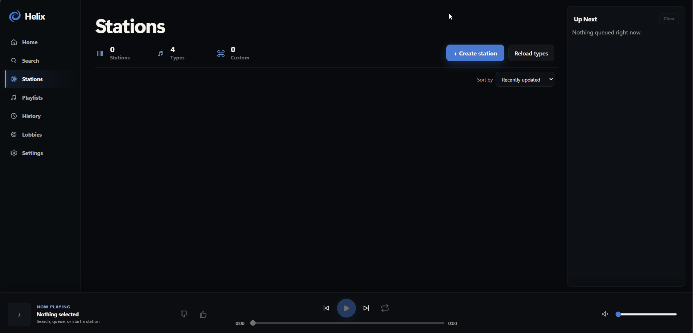

Start a station and let Helix begin filling the queue.

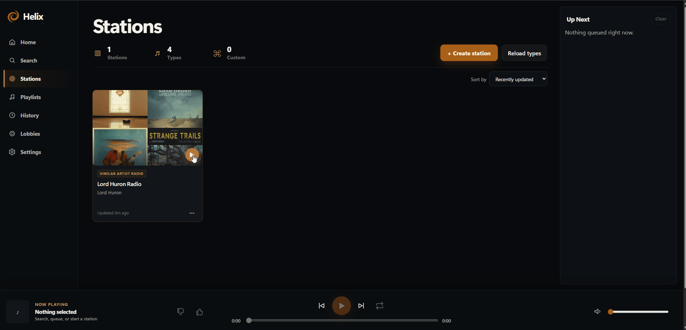

Tune supported stations without rebuilding them from scratch.

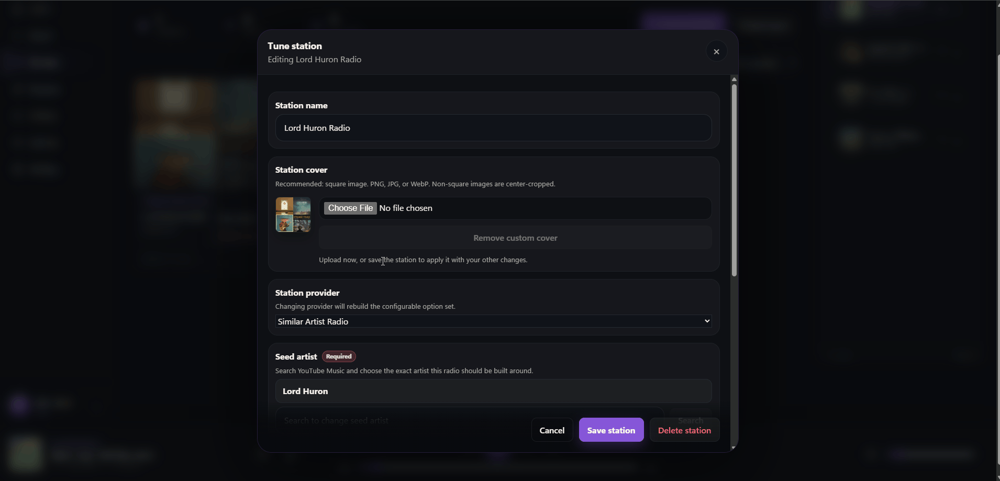

Stations continue filling ahead of playback automatically.

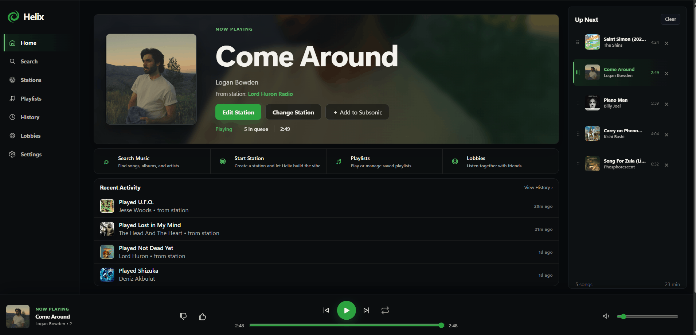

### Queue control

Add a result to the end of the current queue:

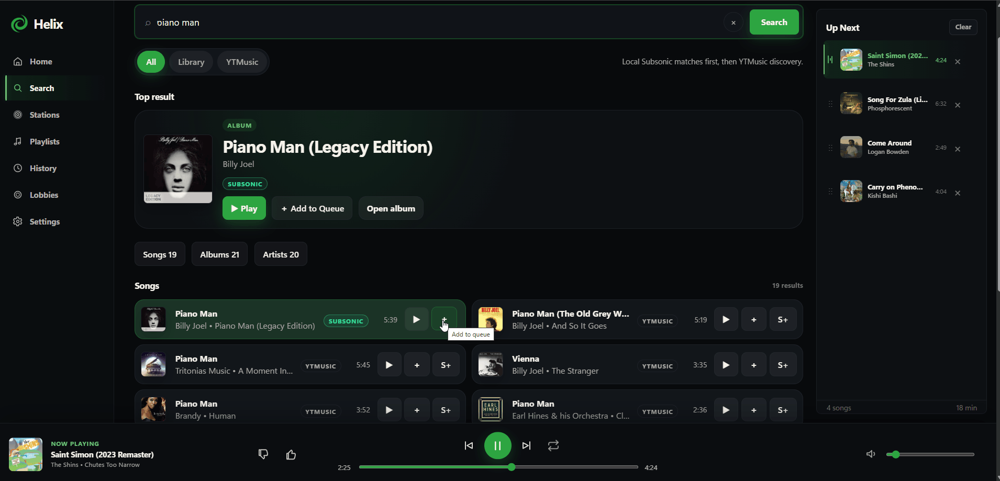

Or insert it as the next track to play:

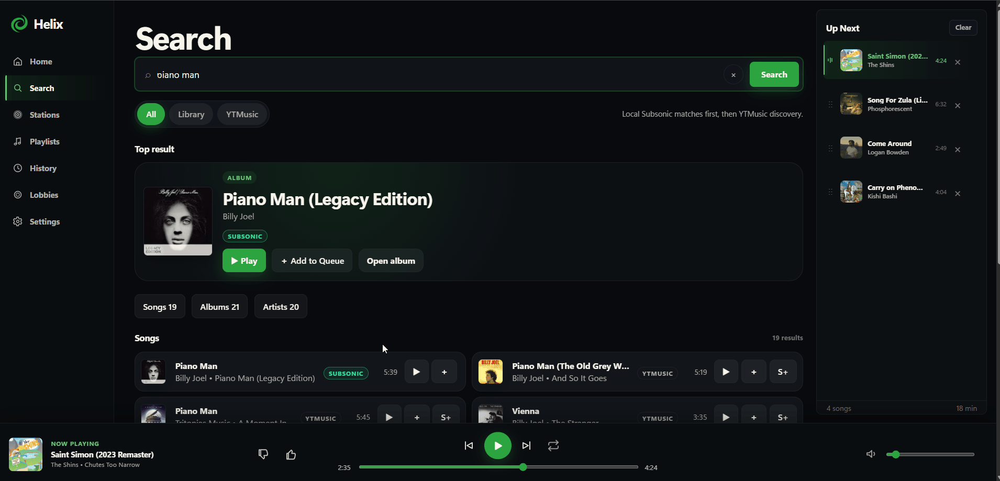

Queue items can also be reordered directly:

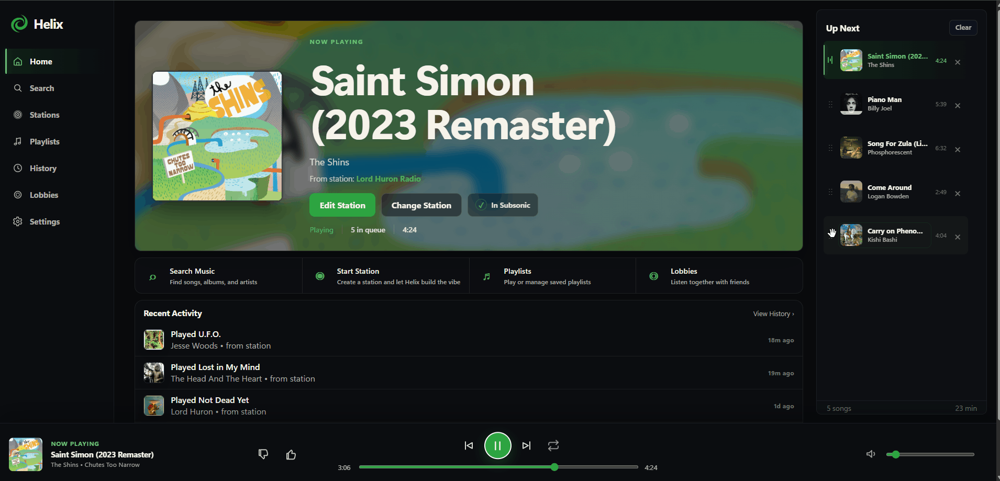

### Add to Subsonic

If fulfillment is enabled, missing music can be requested from Helix and added back into the configured Subsonic library.

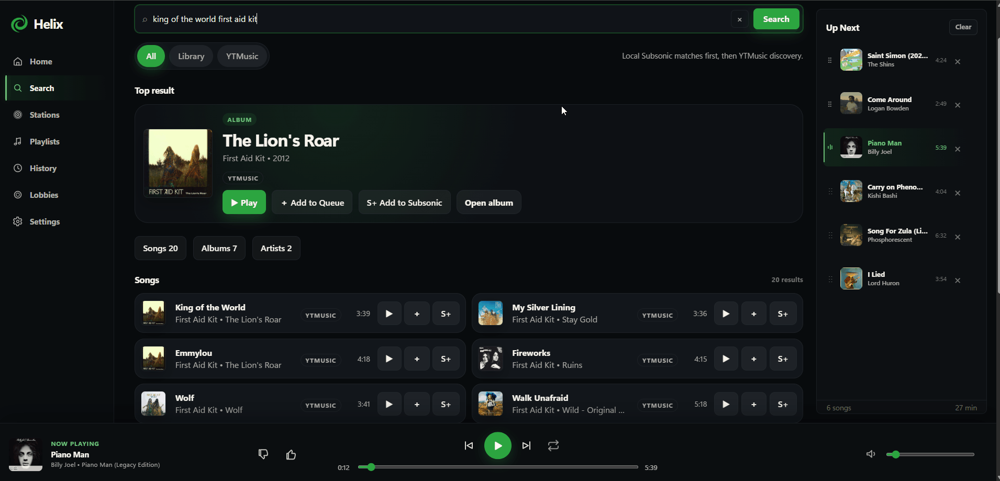

After fulfillment and metadata repair, the imported music appears in the library:

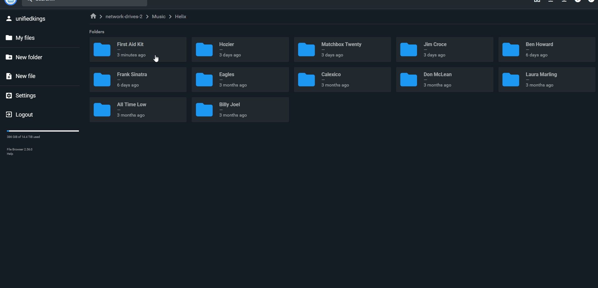

Additional library views:

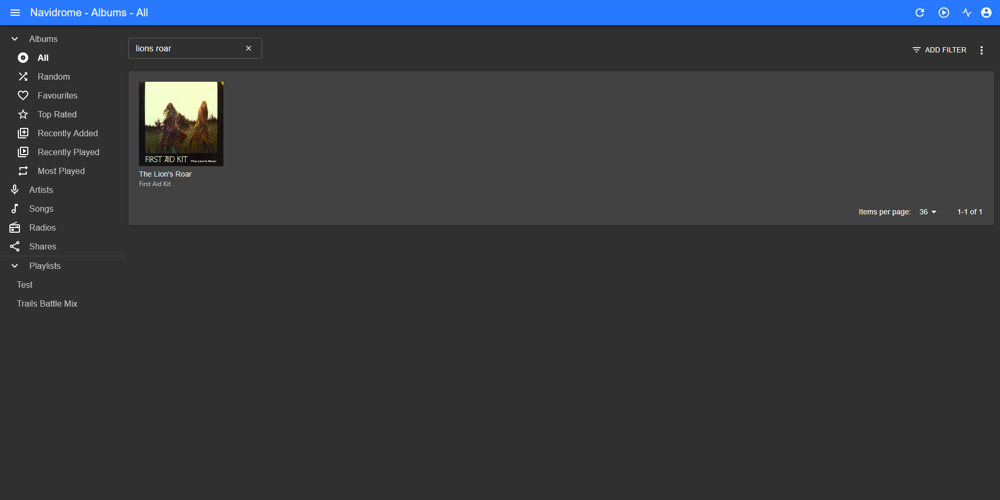

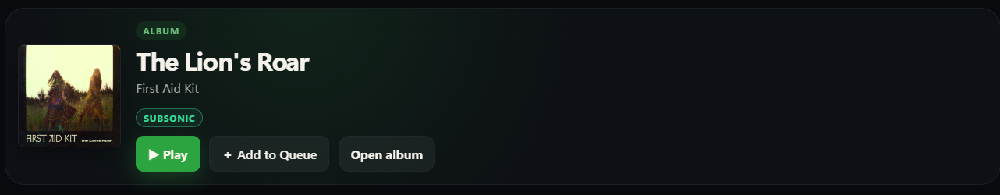

### Shared lobbies

Create a lobby and share its 5-letter join code with other listeners.

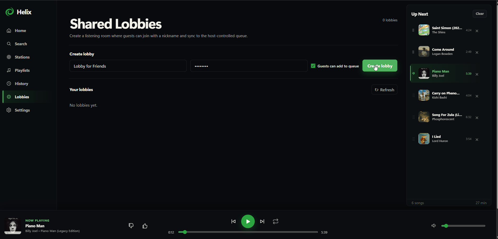

Lobby hosts can configure guest permissions and other lobby behavior.

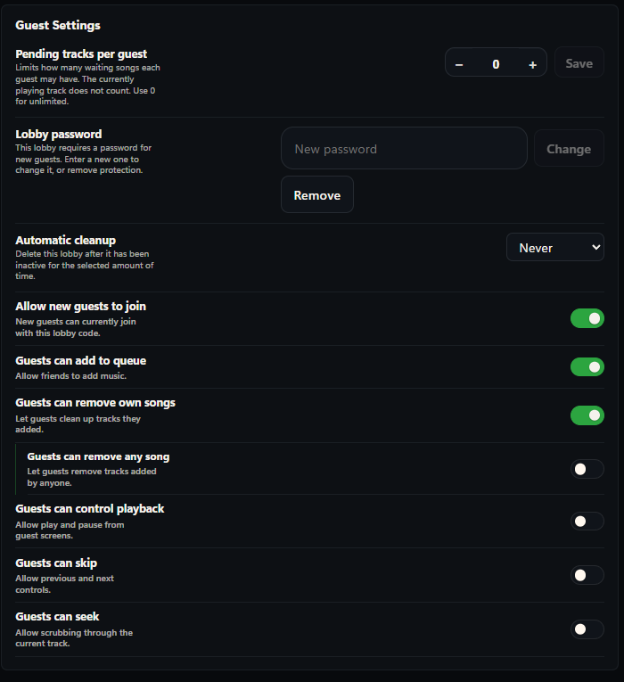

Stations can be started directly inside a lobby and will populate its shared queue.

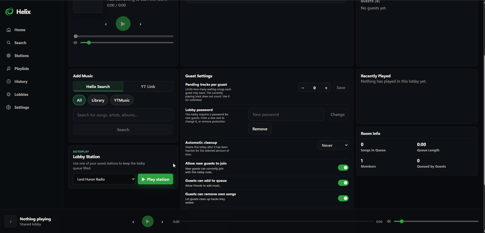

Lobbies maintain synchronized playback state across connected clients.

## How it works

Helix has three main parts:

- **Backend**: Python/FastAPI service for playback state, queues, stations, fulfillment, metadata repair for fulfillment, lobbies, and Subsonic communication.
- **Frontend**: Web UI for search, playback, stations, playlists, lobbies, and settings.
- **Music library**: A Subsonic-compatible server such as Navidrome.

Helix is built with Subsonic in mind. Helix can search it, stream from it, and optionally add requested tracks/albums back into it.

## Important behavior

Helix is designed to be conservative with fulfillment.

- Tracks are handled individually.
- Metadata is repaired before finalization.
- Library imports are controlled by your Beets configuration.
- Only what is requested is added to the Subsonic library.

## Quick start

The easiest way to run Helix is with Docker Compose.

Create a `docker-compose.yml`:

```yaml
services:
  helix:
    image: ghcr.io/unifiedkings/helix:latest
    container_name: helix
    ports:
      - "10011:8000"
    restart: unless-stopped

    volumes:
      # Helix persisted data: database, logs, stream cache, station covers, etc.
      - ./data:/data

      # Inbound download/fulfillment staging
      - ./inbound_yt:/inbound_yt

      # Optional: music library root used by Navidrome/Subsonic/beets.
      # Change this to your real music path, or remove it if you are not using
      # Helix fulfillment/import features.
      - /path/to/music:/data/music

      # Beets config used by Helix fulfillment/import.
      - ./beets_config:/data/helix/beets

      # Optional custom station providers. Disabled by default.
      - ./custom_stations:/data/plugins/stations

    environment:
      # Optional ListenBrainz token. Some station/discovery features may work
      # better with this configured.
      LISTENBRAINZ_TOKEN: ""

      # Optional Subsonic/Navidrome connection.
      # You can also configure these inside the Helix settings UI if supported.
      SUBSONIC_BASE_URL: ""
      SUBSONIC_USERNAME: ""
      SUBSONIC_PASSWORD: ""

      # Keep yt-dlp current independently of the Helix image.
      # Stable is the default; use "nightly" only if you need fixes not yet
      # available in the stable yt-dlp release.
      HELIX_YTDLP_AUTO_UPDATE: "true"
      HELIX_YTDLP_CHANNEL: "stable"

      # Station / queue prefetch
      HELIX_PREFETCH_AHEAD: "3"

      # Max tracks added when someone pastes a playlist/album link into a lobby
      HELIX_LOBBY_YT_LINK_MAX_ITEMS: "100"

      # Public-safe defaults
      HELIX_ENABLE_API_DOCS: "false"
      HELIX_ALLOW_NON_ADMIN_IMPORT: "false"

      # Custom station providers are trusted Python code.
      # Only enable this if you trust every .py file in ./custom_stations.
      HELIX_ENABLE_CUSTOM_STATION_TYPES: "false"
      HELIX_CUSTOM_STATION_TYPES_DIR: "/data/plugins/stations"

      # Optional DB watchdog tuning
      HELIX_DB_WATCHDOG_WARN_S: "2"
      HELIX_DB_WATCHDOG_ERROR_S: "10"
```

Start Helix:

```bash
docker compose up -d
```

Then open:

```text
http://localhost:10011
```

On first launch, Helix will ask you to create an admin account.

## yt-dlp updates

Helix relies on `yt-dlp` for YouTube-backed playback and fulfillment. YouTube changes frequently, and an outdated `yt-dlp` can cause playback or downloads to fail even when the rest of Helix is working normally.

To reduce that failure mode, the Docker image includes a bundled version of `yt-dlp` **and Helix checks for an updated version each time the container starts**. This happens before the Helix application starts, so users do not need to rebuild or pull a new Helix image solely to receive a newer `yt-dlp`.

The default settings are:

```env
HELIX_YTDLP_AUTO_UPDATE=true
HELIX_YTDLP_CHANNEL=stable
```

`HELIX_YTDLP_CHANNEL` supports:

- `stable` — the latest stable `yt-dlp` release. This is the default.
- `nightly` — allows pre-release/nightly builds when a YouTube fix has not reached stable yet.

Set `HELIX_YTDLP_AUTO_UPDATE=false` if you specifically want to use only the version bundled into the Helix image.

### If the yt-dlp update fails

A failed update **does not prevent Helix from starting**. Helix logs a warning and continues with the version already bundled in the container. This keeps temporary package-index or network outages from taking the entire service down.

However, if that bundled version has become too old for current YouTube behavior, YouTube-backed playback and downloads may fail until `yt-dlp` can be updated. If those features suddenly stop working, check the container startup logs for an entry beginning with `[helix-entrypoint]` before assuming the Helix application itself is broken. Restarting the container when network/package access is available will retry the update; pulling a current Helix image also refreshes the bundled fallback version.

Because the update check runs at container startup, restarts may take slightly longer while `pip` checks for or installs a newer `yt-dlp`.

## Subsonic / Navidrome

Helix is built around the Subsonic API. Navidrome is the main target, but other Subsonic-compatible servers may work.

If Subsonic is configured, Helix can:

- search your library
- stream library tracks
- detect whether a track already exists
- add fulfilled tracks back into the library
- support library-only station behavior

If Subsonic is not configured, Helix should disable library-dependent features instead of failing outright.

## Stations

Helix includes built-in station providers for several styles of radio:

- Similar artist radio
- Artist collection radio
- Tag radio

Stations can be tuned with provider-specific settings. Depending on the provider, this may include artist variety, discovery level, source mode, tag strictness, or repeat avoidance.

## Custom station providers

Helix supports custom station providers as Python plugins.

Plugin files can be placed in:

```text
/data/plugins/stations
```

Then enable plugin loading:

```env
HELIX_ENABLE_CUSTOM_STATION_TYPES=true
HELIX_CUSTOM_STATION_TYPES_DIR=/data/plugins/stations
```

Custom station providers are trusted code. They run inside the Helix container. Only enable plugins you wrote yourself or fully trust.

## Lobbies

Lobbies are shared listening sessions where multiple people can join the same queue and playback state.

Each lobby has a simple 5-letter join code and can optionally be password-protected. Hosts can share the code or a direct invite link with other listeners.

Depending on permissions, guests can:

- add tracks to the queue
- remove their own queued tracks
- control playback
- skip tracks
- seek within the current track
- paste supported music links into the lobby queue

Lobby playback state is synchronized between connected clients so everyone can listen along from the same position.

## HelixBot

[HelixBot](https://github.com/UnifiedKings/helixbot) is an optional companion project that connects a Helix lobby to a Discord voice channel.

HelixBot links a Discord server to a Helix lobby using its 5-letter join code, joins Discord voice, and mirrors the lobby's current playback. Helix remains the source of truth: the bot follows track changes, pause/resume, seeks, and queue advancement rather than exposing separate Discord playback controls.

HelixBot runs in its own Docker container and can be configured to connect to any reachable Helix instance.


## Security notes

Before exposing Helix outside your LAN, put it behind HTTPS and review your deployment.

Custom station providers can execute Python code inside the Helix container. Keep them disabled unless you need them.

Recommended public defaults:

```env
HELIX_ENABLE_API_DOCS=false
HELIX_ALLOW_NON_ADMIN_IMPORT=false
HELIX_ENABLE_CUSTOM_STATION_TYPES=false
```

Unless you want to use the custom station feature.

## License

TBD
